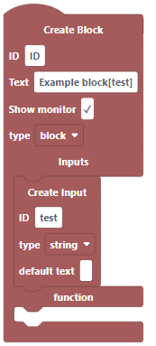
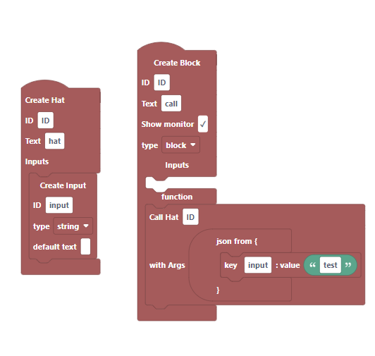

# Blocks
## Create Block
creates a block in you extension
### Arguments
* ID: the ID that the block goes by(make sure the id is __unique__ to other blocks)
* Text: the display name of the block, put any inputs in brackets

* Show monitor: a boolean value representing weather to show the scrath monitor(wont work unless block is a reporter)
* type: the type of block you want to make
    * block: a block that doesn't
    * reporter: a block that returns a value
    * boolean: a block that returns a boolean
* Inputs: an area to put inputs for the block, accepts
    * __Create Input__
    * __Create Input Menu__
    * __Create Input From Menu__
* function: the input to run the function that the block will run
---
## Create Input
Creates an input of a specific type(other than menu's)
### Arguments
* ID: the ID of the Input(make sure the id is __unique__ to other inputs)
* type: the type of the value exepted
    * string
    * number
    * boolean
    * empty: a type that forces you to use a variable
    * color
    * costume
    * sound
    * angle
    * note
    * matrix
* default text: the default value of the input(if the type supports it)
---
## Create Input Menu
Creates a Menu
### Arguments
* ID: the ID of the input(make sure the id is __unique__ to other inputs)
* Accept Reporters: a boolean on weather the input allows Reporters
* Menu: An Array that represents the menu(Accepts a string or a menu item)

---
## Create Menu
like "Create Input Menu", this block will create a menu, but it can be used more than once
### Arguments
* ID: the ID of the menu(make sure the id is __unique__ to other menus)
* Accept Reporters: a boolean on weather the input allows Reporters
* Menu: An Array that represents the menu(Accepts a string or a menu item)

---
## Create Input From Menu
creates an input from a menu created will "Create Menu"
### Arguments
* ID: the ID of the input(make sure the id is __unique__ to other inputs)
* Menu ID: The Id of the menu you want to use(make sure the Menu Id is the same and the Id of the menu)

---
## Menu Item
creates a menu item
__returns: Object__
### Arguments
* text: the text that the menu shows
* value: the value the item returns when getting the Input
---
## Get Input
gets a value of an input and returns it
### Arguments
* Input ID: the ID of the input you want
---
## Return
returns from a block
### Arguments
* value: the return value
---
## Create Hat
creates a Hat Block
### Arguments
* ID: the ID of the Hat(make sure the ID is __unique__ to other Hats)
* Text: the display name of the block, put any inputs in brackets

---
## Call Hat/ Call Hat With Args
calls a hat block through the scratch vm(make sure the extension is unsandboxed)
### Arguments
* ID: the ID of the Hat ou want to call
* Args(for __Call Hat With Args__ only): an Object that represents the inputs in the hat

---
