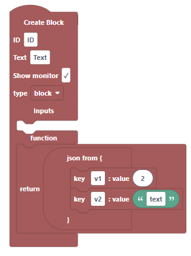

# JSON
## JSON from
makes an object from json elements
__returns: Object__
### Arguments
* key value pair: blocks that represent the key value pairs

___
## key
represents the key value pair for json from
### Arguments
* key: the key of the JSON
* value: the value of the JSON
___
## in Object get
gets a value of an object
__returns: any__
### Arguments
* Object: the Object you are getting from
* key: the key to the value you want
___
## in Object set
sets the value of a key in a value(doesn't change the original Object, only returns a new one)
__returns: Object__
### Arguments
* Object: the Object you are seting a value of
* key: the key that your setting
* value: the value your setting it to
___
## parse
gets an object from a JSON string
__returns: Object__
### Arguments
* string: the string the Object gets created from
___
## stringify
gets a string from an Object
__returns: string__
### Arguments
* Object: the Object that you want as a string
___
## Create Empty Object
creates an Empty Object
__returns: Object__
## get [] from Object
gets a thing from the Object
__returns: Array__
### Arguments
* type: menu of what you want to get
    * keys
    * values
* Object: the Object
___
